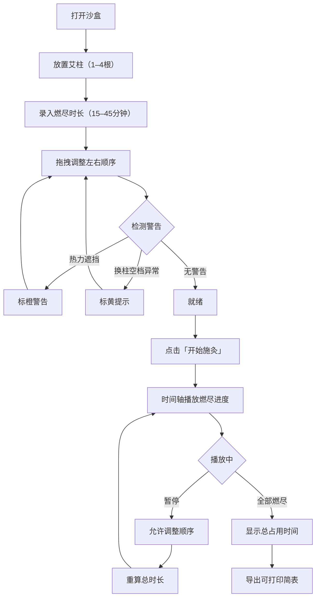

## 1. 产品概述

民族医馆艾灸室「多柱燃尽顺序排程沙盒」——纯浏览器端艾灸施灸排程模拟工具，帮助灸师在施灸前预判多柱燃尽顺序、热力遮挡风险与换柱空档，优化排程方案。目标用户为中医馆灸师与培训学员。

## 2. 核心功能

### 2.1 用户角色
| 角色 | 使用方式 | 核心权限 |
|------|----------|----------|
| 灸师 | 无需注册，直接使用 | 创建排程、拖拽调序、播放时间轴、导出简表 |

### 2.2 功能模块
1. **排程编辑页**：床位画布、柱体拖拽排序、燃尽参数录入、警告标注、开始施灸控制
2. **时间轴播放区**：燃尽进度可视化、暂停/继续、换柱空档提示
3. **导出简表**：可打印排程摘要

### 2.3 页面详情
| 页面名称 | 模块名称 | 功能描述 |
|----------|----------|----------|
| 排程编辑页 | 床位画布 | 横向展示床位，竖排最多4根艾柱，标注燃尽时长，柱间距≥8格距 |
| 排程编辑页 | 柱体参数录入 | 点击柱体输入燃尽分钟（15–45），高度随分钟数映射 |
| 排程编辑页 | 拖拽排序 | 拖拽柱体调整左右顺序，实时重算警告 |
| 排程编辑页 | 热力遮挡警告 | 相邻两柱若较高柱燃尽时间比较矮柱短10分钟以上，标橙色「热力遮挡」 |
| 排程编辑页 | 施灸控制 | 「开始施灸」按钮启动时间轴，播放中锁定排序 |
| 时间轴播放区 | 燃尽进度条 | 按顺序播放每柱燃尽，柱体高度随时间缩减 |
| 时间轴播放区 | 换柱空档 | 前柱燃尽与后柱点燃间隔2分钟（默认），<1或>5分钟标黄提示 |
| 时间轴播放区 | 暂停/继续 | 暂停后可调整顺序，调整后须重算总时长 |
| 导出简表 | 打印简表 | 柱序、燃尽时长、总占用分钟、全部警告摘要 |

## 3. 核心流程

用户在床位画布上放置1–4根艾柱，录入每柱燃尽时长（15–45分钟），通过拖拽调整左右顺序。系统实时检测热力遮挡（橙警告）与换柱空档异常（黄提示）。点击「开始施灸」后，时间轴按顺序播放燃尽进度，播放中禁止改顺序。可暂停后调整，调整后重算总时长。完成后可导出可打印简表。

## 4. 用户界面设计

### 4.1 设计风格
- **主色调**：暖赭石色（#B85C38）+ 艾草绿（#5C8A4D），传达中医艾灸温暖自然之感
- **辅色**：米白底（#FDF6EC）、深棕文字（#3E2723）
- **警告色**：橙色（#E67E22）表示热力遮挡，黄色（#F1C40F）表示换柱空档异常
- **按钮风格**：圆角胶囊按钮，施灸按钮为赭石色实心，暂停为绿描边
- **字体**：标题使用「思源宋体」风格衬线字体，正文使用系统无衬线
- **布局**：上部为床位画布区，下部为时间轴播放区，右侧为参数面板
- **图标**：艾草、火焰、床位等中医意象图标

### 4.2 页面设计概述
| 页面名称 | 模块名称 | UI元素 |
|----------|----------|--------|
| 排程编辑页 | 床位画布 | 横向长条床位（米白底+木纹边框），柱体为竖向矩形条，高度映射燃尽时长，底部标注分钟数，柱体间标注格距 |
| 排程编辑页 | 参数面板 | 右侧侧栏，每柱燃尽分钟输入框（滑块+数字），间距设定 |
| 排程编辑页 | 控制栏 | 底部中央：开始施灸/暂停/重置按钮组 |
| 时间轴播放区 | 进度条 | 横向时间轴，柱体色块按序排列，当前燃尽柱体动画缩减，换柱空档为虚线段 |
| 时间轴播放区 | 计时器 | 当前时间、剩余时间数字显示 |
| 导出简表 | 打印视图 | 白底表格，柱序/时长/总占用/警告，打印友好 |

### 4.3 响应式
- 桌面优先设计（1200px+）
- 平板适配（768px–1200px）：参数面板折叠为底部抽屉
- 手机端（<768px）：画布纵向排列，基本可用

### 4.4 无3D场景
