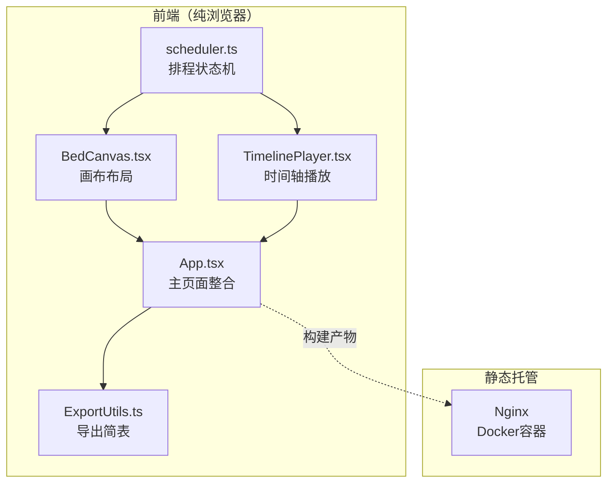

## 1. 架构设计



## 2. 技术说明
- **前端框架**：React@18 + TypeScript + Tailwind CSS + Vite
- **初始化工具**：vite-init（react-ts 模板）
- **状态管理**：Zustand（排程状态机核心）
- **后端**：无（纯前端，所有逻辑在浏览器端完成）
- **数据库**：无（状态全部在内存中，不持久化）
- **拖拽**：HTML5 Drag & Drop API（原生实现，不引入第三方拖拽库）
- **导出**：CSS @media print + window.print() 实现可打印简表
- **托管**：Docker + Nginx 静态文件服务

## 3. 路由定义
| 路由 | 用途 |
|------|------|
| / | 排程编辑主页面（单页应用，所有功能集中） |

## 4. 无后端 API

## 5. 无后端服务架构

## 6. 数据模型

### 6.1 数据模型定义

```mermaid
erDiagram
    Schedule ||--o{ MoxaColumn : contains
    Schedule {
        string id
        string status idle
        number totalMinutes
        number gapMinutes 2
        number elapsedMinutes 0
    }
    MoxaColumn {
        string id
        number order
        number burnMinutes
        number height
        number positionX
        boolean isThermalBlocked
        boolean isGapWarning
    }
```

### 6.2 数据定义（TypeScript 接口）

```typescript
interface MoxaColumn {
  id: string;
  order: number;
  burnMinutes: number;
  height: number;
  positionX: number;
  isThermalBlocked: boolean;
  isGapWarning: boolean;
}

interface Schedule {
  id: string;
  status: 'idle' | 'playing' | 'paused' | 'finished';
  columns: MoxaColumn[];
  gapMinutes: number;
  totalMinutes: number;
  elapsedMinutes: number;
  currentColumnIndex: number;
  warnings: Warning[];
}

interface Warning {
  type: 'thermal_block' | 'gap_abnormal';
  columnIds: [string, string];
  message: string;
}
```

## 7. 模块拆分

### 7.1 排程状态机（scheduler.ts）
- Zustand store 管理 Schedule 状态
- 状态转换：idle → playing → paused → playing / finished
- 核心逻辑：热力遮挡检测、换柱空档检测、总时长计算
- 拖拽排序触发重算

### 7.2 画布布局（BedCanvas.tsx）
- Canvas/SVG 绘制床位与柱体
- 拖拽交互实现（HTML5 DnD）
- 柱间距可视化（格距标注）
- 警告标记渲染（橙/黄）

### 7.3 时间轴播放（TimelinePlayer.tsx）
- requestAnimationFrame 驱动时间轴
- 柱体燃尽动画（高度缩减）
- 换柱空档倒计时
- 播放/暂停/重置控制

### 7.4 导出工具（ExportUtils.ts）
- 生成可打印 HTML 表格
- @media print 样式
- 柱序、燃尽时长、总占用分钟、警告摘要
